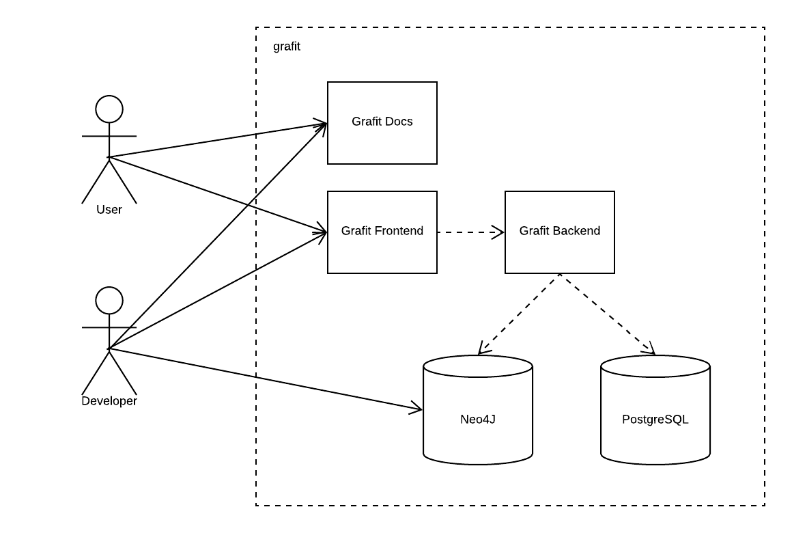

# Containerization

Grafit is split up in five different docker containers.

When using the production docker-compose file the frontend (port 3000) and the doc server (port 8001) as well as the backend(port 8000), that is used by the user via the frontend, are exposed to the network.  
If the docker-compose.dev.yml is used, the webinterface of the Neo4J container is exposed on port 7474.
