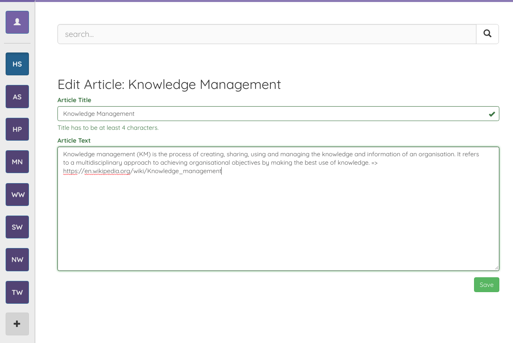
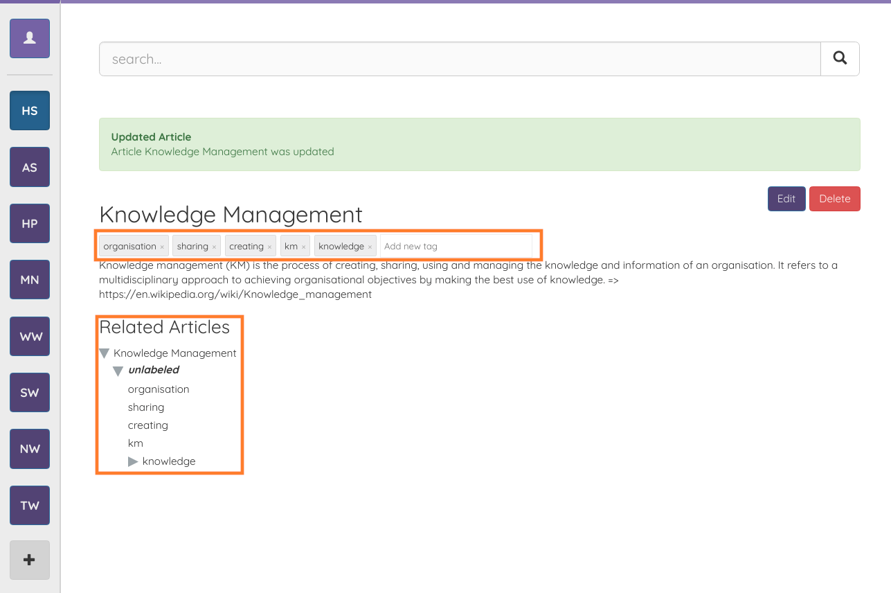
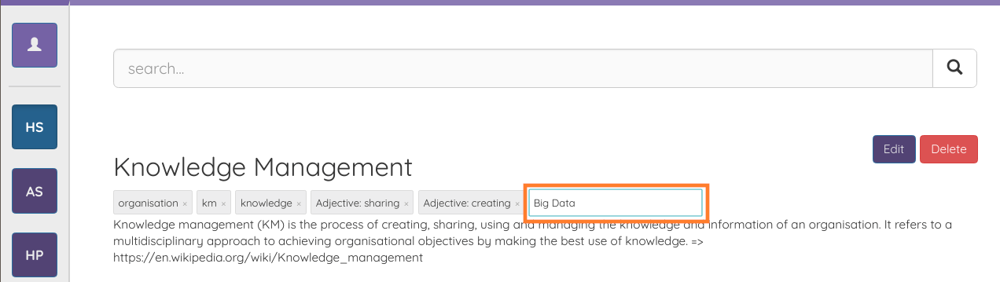
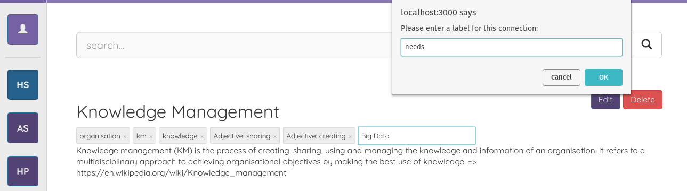
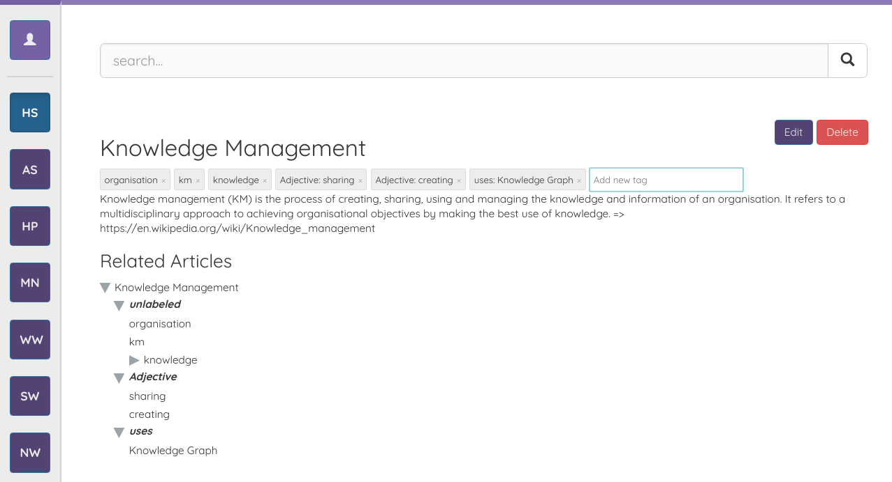

## Create a New Article

To create a new article click the "Create New Article" button below the search bar. A form opens up where the title for the article as well as the text can be set. The article has to be unique on a per workspace basis.

Any links in the text will be followed, the content crawled and added to the serach index.  
The most important keyphrases in your text are extracted using natural language processing algorithms. The article is then connected to those keyphrases. The result looks as follows.

Marked in orange are the connected keyphrases. The keyphrases are articles too and you can navigate to them using the tree view below the article.

## Create a New Connection between Articles

If you want to manually add another connection to the existing ones you can easily do so by typing in the "Add new tag" box marked in orange in the image below.

When typing in the input field you will notice, that there is autocomplete assisting you to find existing articles. If an article does not yet exist you simply type out the desired name and press enter. A new article with the corresponding name will then be created for you.  
Once connection to the new article is created an input field appears asking you to label this connection.

Don't worry if you don't know a name for the connection. Simply let the input field empty and click "OK".

## Label existing Connection

If you want to add or edit a label of an existing connection you can do so by clicking on the tag of that connection. Similar to when creating a new connection you are then asked to input a new label for that connection.

Adding labels to the connections can be very valuable, as the connections are grouped in the tree view below the article text. You will find the connections where no label is set under "unlabeled".

