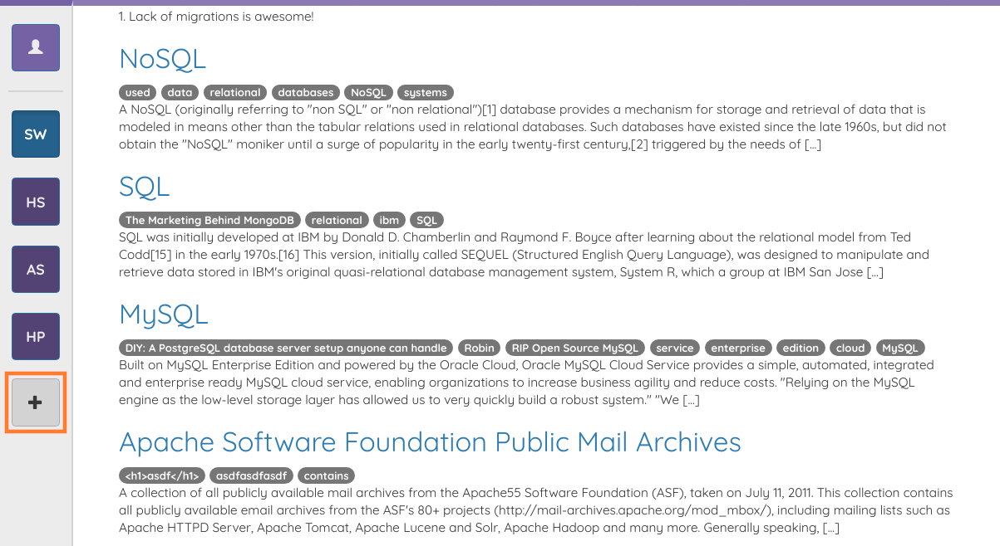
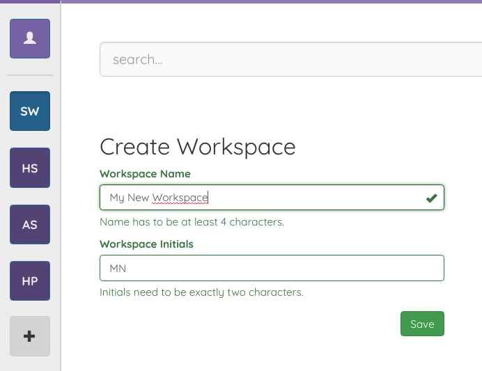
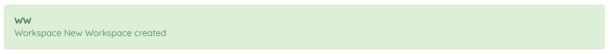

# Create a New Workspace

A new workspace can be created by clicking on the plus button in the workspace bar to the left.

After clicking that button, a form appears that allows you to input your workspace name as well as your workspace initials. By default the initials are the starting letter of the first two words appearing in the workspace name.

When you click save a alert bar will appera and inform you that the workspace was created successfully.

