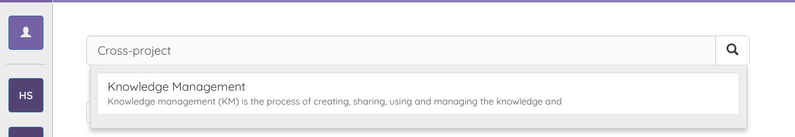

# Search

When using grafit, you will notice that a very prominent UI element is the search bar that is on the top of almost every page.
With the search bar you can search for articles using their title, text or even link content. If you paste a URL into the text of an article, the URL will be crawled and the content added to the search index.  
In the example below you will see that we search for "cross-project" and the article "Knowledge Management" is shown as the top search result.

As you will see in the image below, the phrase "cross-project" does not appear in the article text. Instead it appears in the Wikipedia article that is linked.

