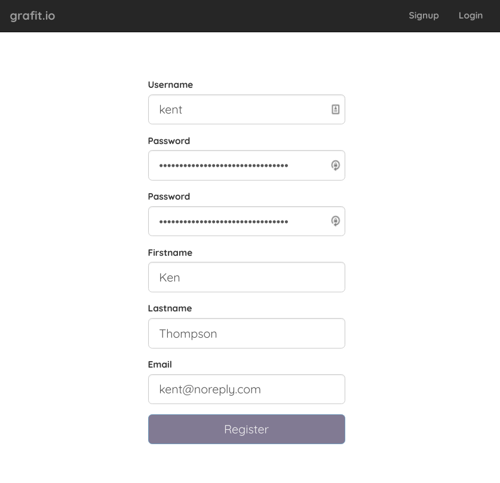
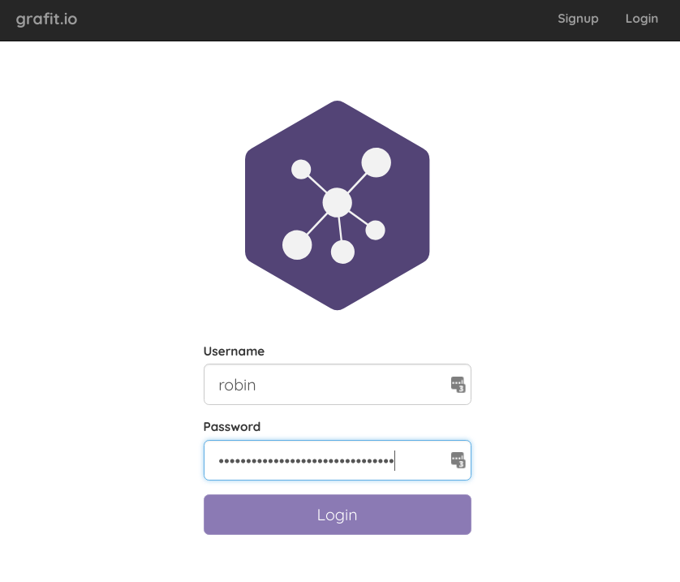

This user guide will show you all the necessary steps to get started using [_**grafit**_](https://github.com/grafit-io/grafit/).

## Sign Up

By clicking the sign up Button you can register yourself.

## Login

After the sign up is completed you can login via the login button in the top bar.

